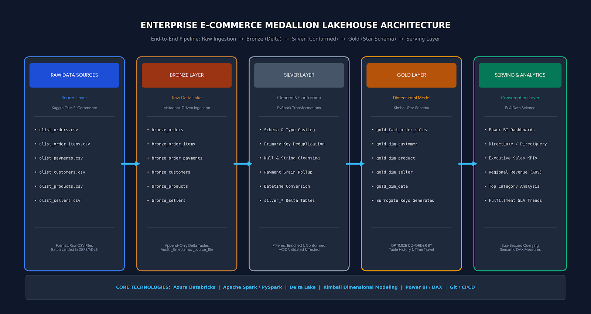

# azure-databricks-ecommerce-lakehouse
# 🛒 Enterprise E-Commerce Medallion Lakehouse Pipeline

[](https://community.cloud.databricks.com)
[](https://spark.apache.org/)
[](https://delta.io/)
[](https://www.python.org/)
[](https://powerbi.microsoft.com/)

An end-to-end cloud data engineering project implementing a production-grade **Medallion Lakehouse Architecture (Bronze $\rightarrow$ Silver $\rightarrow$ Gold)** on the **Olist Brazilian E-Commerce dataset**. The pipeline demonstrates metadata-driven batch ingestion, schema enforcement, deduplication, surrogate key generation, Kimball Star Schema modeling, Delta Lake performance optimization (`OPTIMIZE`, `Z-ORDER`, `VACUUM`), and analytical serving.

---

## 🏗️ Architecture Overview




[Raw CSVs (DBFS / ADLS)]
│
▼ (01_bronze_ingestion.py - Metadata-driven loop)
[Bronze Layer: Append-only Delta Tables + Audit Columns]
│
▼ (02_silver_cleansing.py - Type casting, deduplication, validation)
[Silver Layer: Conformed & Enriched Delta Tables]
│
▼ (03_gold_dimensional.py - Kimball Star Schema & surrogate keys)
[Gold Layer: Dimensional Star Schema & Fact Tables]
│
├──────────────────────────────┬─────────────────────────────┐
▼ (04_lakehouse_analytics.py)  ▼                             ▼
[Z-ORDER / Compaction]         [Power BI Semantic Layer]    [Business KPIs]


---

## 📁 Repository Structure

```text
azure-databricks-ecommerce-lakehouse/
│
├── diagrams/
│   └── medallion_architecture_diagram.png    # End-to-end architecture schematic
│
├── notebooks/
│   ├── 01_bronze_ingestion.py                # Dynamic metadata ingestion into Bronze Delta
│   ├── 02_silver_cleansing.py                # Schema validation, type casting & deduplication
│   ├── 03_gold_dimensional.py               # Star Schema modeling (Facts & Dimensions)
│   └── 04_lakehouse_analytics.py              # Z-Ordering, VACUUM, Time Travel & Analytics KPIs
│
├── sql/
│   └── ddl_delta_tables.sql                  # Delta Lake table DDLs
│
├── .gitignore
└── README.md


##⚙️ Medallion Pipeline Stages
##1. 🥉 Bronze Layer: Raw Metadata-Driven Ingestion

    Source: Multi-entity raw CSV files from the Olist E-Commerce dataset landed in DBFS/ADLS.

    Mechanism: Iterates dynamically across all source entities using a Python config dictionary.

    Auditability: Enriches every table with _ingestion_timestamp and _source_file metadata.

    Storage Format: Append-only Delta Lake tables (bronze_orders, bronze_order_items, bronze_customers, etc.).

##2. 🥈 Silver Layer: Cleansing & Conformation

    Schema Enforcement: Strict data type casting (converting ISO strings to TimestampType, prices and fees to DoubleType).

    Deduplication: Primary key validation on natural identifiers (order_id, customer_id, seller_id).

    Grain Rollup: Pre-aggregates multi-installment payments at the order_id level to eliminate duplicate fan-out during downstream fact table joins.

    Data Quality: Null filtering and imputation on missing categorical values.

##3. 🥇 Gold Layer: Kimball Dimensional Modeling

    Design: Star Schema optimized for OLAP aggregations, DirectQuery, and Power BI semantic layers.

    Dimensions:
        gold_dim_customer (Customer location, unique IDs, surrogate key customer_dim_key)
        gold_dim_product (Product categories, dimensions, freight weights)
        gold_dim_seller (Seller location attributes)
        gold_dim_date (Extracted Calendar hierarchy: Year, Month, Day, Day of Week)

    Fact Table:
        gold_fact_order_sales (Grain: 1 row per order item, joined with aggregated payment metrics and delivery dimensions).

##🚀 Lakehouse Performance Tuning & Optimization

##Implemented in 04_lakehouse_analytics.py:
    1. Z-Order Clustering: Co-locates multi-dimensional data to maximize file skipping during high-cardinality filters:
       OPTIMIZE gold_fact_order_sales ZORDER BY (order_date, customer_id, product_id);

    2. Table Maintenance & Garbage Collection: Removes stale uncommitted data files beyond the retention window:
       VACUUM gold_fact_order_sales RETAIN 168 HOURS;

    3. Delta ACID & Time Travel: Inspects table versions via transaction logs:
       DESCRIBE HISTORY gold_fact_order_sales;

##📊 Business KPIs & Analytical Outputs
The pipeline answers key executive business questions directly from the Gold layer:
    1. Regional Performance: Total revenue, order volume, and Average Order Value (AOV) aggregated by customer state.
    2. Category Profitability: Top 10 product categories by total sales volume versus average logistics/freight overhead.
    3. Fulfillment Health: Breakdown of operational status (Delivered, Shipped, Canceled, Invoiced) to evaluate SLA breaches.

##🛠️ How to Run This Project
    Prerequisites
      * A free Databricks Community Edition account.
      * A cluster running Databricks Runtime 13.x+ (Spark 3.x, Scala 2.12).
      * Kaggle Brazilian E-Commerce Dataset by Olist.

##Steps
  1. Clone Repo in Databricks:
    * Go to Workspace $\rightarrow$ Repos $\rightarrow$ Add Repo.
    * URL: https://github.com/<your-username>/azure-databricks-ecommerce-lakehouse.git.
  2. Upload Data: Upload the Olist CSV files to Databricks FileStore (/FileStore/tables/).
  3. Execute Notebooks sequentially:
    * Run 01_bronze_ingestion.py
    * Run 02_silver_cleansing.py
    * Run 03_gold_dimensional.py
    * Run 04_lakehouse_analytics.py

👨‍💻 Author
Mohammed Ismail Z
Lead Data and Process Analyst
